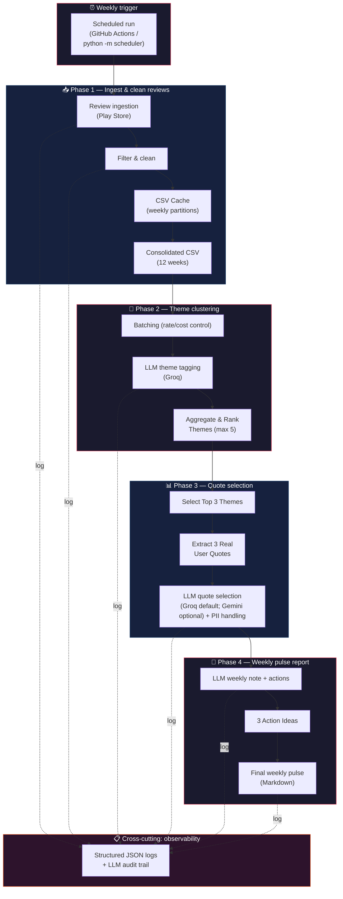
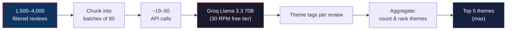
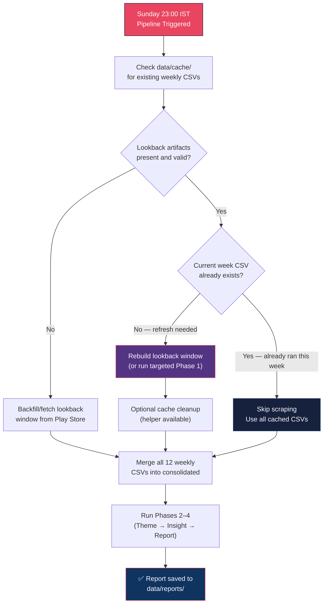
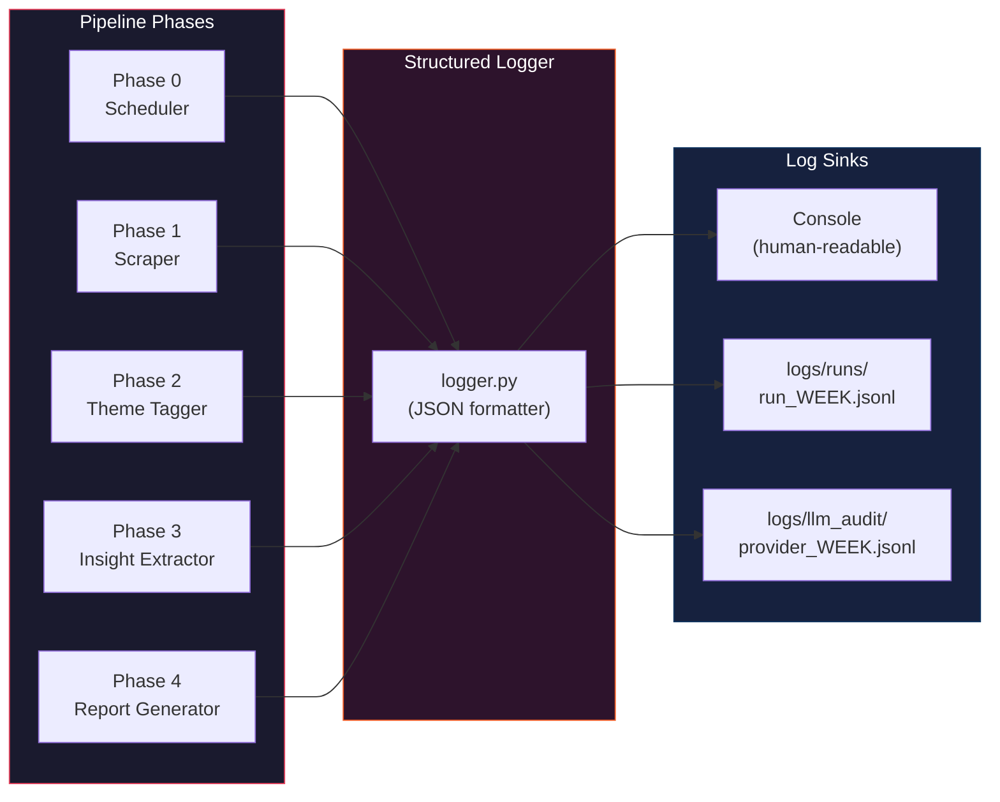
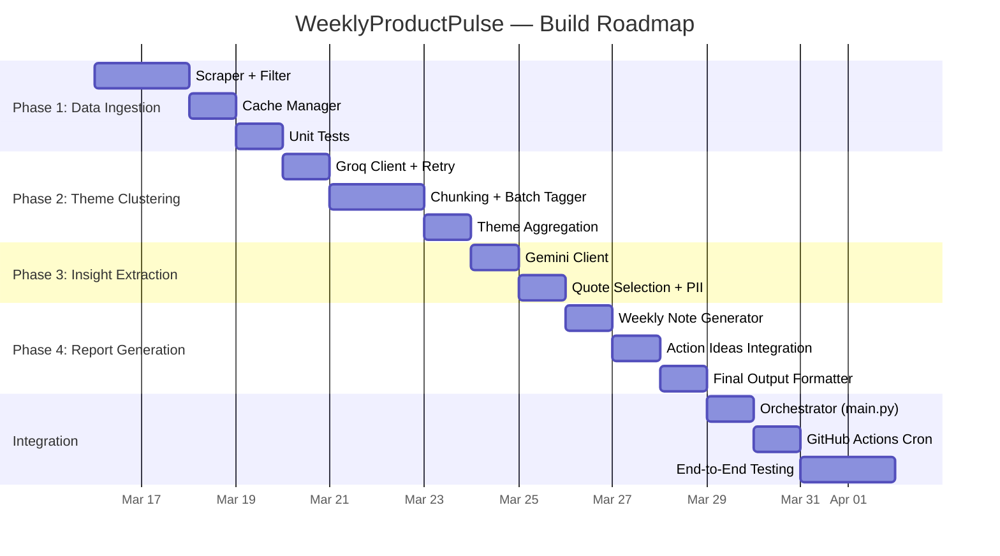

# 🔬 WeeklyProductPulse — Architecture Document

> **Product**: IndMoney Play Store Review Intelligence  
> **Author**: Senior AI Product Manager  
> **Date**: 24 March 2026  
> **Version**: 2.1

---

## 1. Executive Summary

WeeklyProductPulse is an automated pipeline that scrapes recent IndMoney Play Store reviews from a configurable lookback window (default 12 weeks), clusters them into themes, and produces a concise, PII-free weekly intelligence note — complete with user quotes and actionable recommendations. The system uses **free-tier LLM options** (Groq Llama 3.3 70B by default; Gemini optional per phase via config/env) with chunking and caching controls for rate limits.

**Distribution & operations (v1.6+):** Outputs can be pushed to **Google Docs** (REST API with a service account, or **OAuth + MCP** via `@a-bonus/google-docs-mcp` from Python or Cursor). A **FastAPI** app (`web/main.py`) exposes the report and email APIs and can still serve a legacy static tree under `web/static/`. The **primary production dashboard** is a **Next.js** app in `frontend/` (deployed on **Vercel**): App Router, **Lora** + **DM Sans** (Google Fonts), DOMPurify-sanitized report HTML, ambient hero treatment, current-ISO-week preference, cache-busting refresh, email success popup, and brand mark in `frontend/public/assets/images/`. Next.js `rewrites` proxy `/api/*` to the backend (`PULSE_API_UPSTREAM`, default Render URL). **Vercel** must use **Root Directory `frontend`** (not the repo root): `frontend/vercel.json` runs `cd .. && npm install` and `cd .. && npm run build -w frontend` so the workspace lockfile is used and `.next` stays under `frontend/` (copying `.next` to the repo root breaks serverless function paths). Email uses **SMTP (default)** or **MCP email transport** (`EMAIL_TRANSPORT=mcp`); MCP defaults to **one subprocess per recipient** (Gmail MCP often breaks on a second send in the same session). Optional **`EMAIL_MCP_BATCH=1`** uses one session for all recipients when supported. The backend runs on **Render** (Docker free tier). A dedicated **external ping service** (e.g. **cron-job.org** or **Better Stack**, both free) pings `GET /api/health` every 5 minutes to prevent Render free-tier cold-start delays. GitHub Actions cron (`keep-render-awake.yml`) is kept as a secondary backup but is not reliable enough alone — free-tier runs can be delayed 15–30 min, exceeding Render's 15-min sleep window. **GitHub Actions** also runs the scheduled pipeline; CI validates required secrets and commits generated `*_pulse.md` files to the repo so the next Render deploy bakes reports into the image.

---

## 2. Weekly Pulse Workflow (Product View)




---

## Flow Overview (Product Copy)

This is the end-to-end weekly cycle from “what users said” to “what leaders get”:

```
Weekly trigger
     |
     v
Phase 1: Ingest & clean reviews
     |
     v
Phase 2: Theme tagging + clustering (top themes)
     |
     v
Phase 3: Quote selection (PII-safe)
     |
     v
Phase 4: Weekly pulse report + 3 action ideas
```

## 3. Phase-Wise Detailed Design

---

### Product outcomes (what each phase should deliver)


| Phase                         | Primary output artifact                                                   | Audience value                                 | Definition of success (product lens)                                                                                       |
| ----------------------------- | ------------------------------------------------------------------------- | ---------------------------------------------- | -------------------------------------------------------------------------------------------------------------------------- |
| Phase 1 — Ingest & clean      | `data/cache/<week>.csv` + `data/consolidated/<week>_full.csv`             | A reliable dataset of recent customer feedback | Dataset is usable for analysis (filters applied; short/irrelevant reviews removed).                                        |
| Phase 2 — Theme clustering    | `data/tagged/<week>_tagged.csv` + `data/tagged/<week>_theme_summary.json` | Clear “what users talk about” buckets          | Top themes are stable enough to compare week-over-week (max themes limited).                                               |
| Phase 3 — Quote selection     | `data/tagged/<week>_insights.json` (expected)                             | Representative quotes for leadership           | Quotes align to the theme, are concise, and are free of PII (LLM + regex safety net).                                      |
| Phase 4 — Weekly pulse report | `data/reports/<week>_pulse.md` (expected)                                 | A decision-ready weekly briefing               | Report is short (<= `MAX_REPORT_WORDS`), includes top 3 themes with one quote each, and ends with 3 implementable actions. |


> Note: everything below this table is an engineering deep-dive (prompts, budgets, retries, and implementation details).

### Phase 0 — Scheduler & Orchestrator


| Attribute                      | Detail                                                                                                                                                        |
| ------------------------------ | ------------------------------------------------------------------------------------------------------------------------------------------------------------- |
| **Trigger**                    | **Every Sunday 10:00 PM IST** (16:30 UTC) via [`.github/workflows/scheduled-pulse.yml`](.github/workflows/scheduled-pulse.yml); or manual `workflow_dispatch` / local cron |
| **Mechanism**                  | GitHub Actions `schedule` + `workflow_dispatch`; locally: **`python -m scheduler`** or [`scripts/run_e2e.sh`](scripts/run_e2e.sh) |
| **Entry point (current repo)** | [`scheduler/run_pipeline.py`](scheduler/run_pipeline.py) (`python -m scheduler`) runs Phase 1 (mode: `auto`/`incremental`/`backfill`) → 2 → 3 → 4. Optional: **[`EMAIL_REPORT_AFTER_PIPELINE`](docs/WEB_DASHBOARD.md)** sends post-run email after Phase 4. See [docs/SCHEDULER.md](docs/SCHEDULER.md). |
| **Idempotency**                | Week-based caching in `data/cache/` and derived artifacts in `data/tagged/` so re-runs can be incremental. |
| **CI / secrets**               | Workflow sets `GROQ_API_KEY`, `GEMINI_API_KEY`, optional Google OAuth + MCP token for Doc append; Node 20 for `npx`. See workflow file and [docs/SCHEDULER.md](docs/SCHEDULER.md). |
| **E2E test**                   | [docs/E2E_PIPELINE.md](docs/E2E_PIPELINE.md) — full pipeline or `SKIP_BACKFILL=1` when `data/consolidated/<week>_full.csv` exists. Script now parses `.env` safely (no shell `source` dependency), so values with spaces (e.g. `SMTP_FROM`) are supported. |


**Orchestrator Pseudocode:**

```python
def run_weekly_pulse():
    # 0. Initialize structured logger for this run
    run_id = generate_run_id()  # e.g. "run_2026-W11_20260315T2300"
    logger = init_logger(run_id)
    logger.info("pipeline_start", week=current_week, run_id=run_id)

    # 1. Determine current ISO week
    current_week = get_iso_week()  # e.g. "2026-W11"

    # 2. Check which weekly CSVs already exist in cache
    cached_weeks = list_cached_weeks()  # ["2026-W02", ..., "2026-W12"]
    logger.info("cache_check", cached=len(cached_weeks), total_needed=12)

    # 3. Compute delta — only fetch the new week's reviews
    weeks_needed = compute_12_week_window(current_week)
    missing_weeks = [w for w in weeks_needed if w not in cached_weeks]
    logger.info("delta_computed", missing_weeks=missing_weeks)

    # 4. Fetch only missing weeks (typically just 1 new week)
    for week in missing_weeks:
        fetch_and_cache_reviews(week)
        logger.info("week_fetched", week=week)

    # 5. Merge all 12 weekly CSVs into one consolidated DataFrame
    df = merge_weekly_csvs(weeks_needed)
    logger.info("data_merged", total_reviews=len(df))

    # 6. Run the analysis pipeline
    themes      = phase2_cluster_themes(df)
    insights    = phase3_extract_insights(df, themes)
    report      = phase4_generate_report(insights)

    # 7. Save output
    save_report(report, current_week)
    logger.info("pipeline_complete", week=current_week, report_path=report.path)
```

> [!TIP]
> **Current scheduler behavior**: `python -m scheduler` supports `SCHEDULER_PHASE1_MODE=auto|incremental|backfill` (default `auto`). In `auto`, missing lookback weeks are fetched and consolidated, then Phases 2–4 run.

### Phase 0.1 — Distribution: Google Docs, Cursor MCP, web dashboard & email

| Path | Role |
|------|------|
| **Phase 4 append** | [`shared/google_docs_client.py`](shared/google_docs_client.py) (`GOOGLE_DOCS_APPEND_TRANSPORT=direct` + service account) or [`shared/mcp_google_docs_append.py`](shared/mcp_google_docs_append.py) (`=mcp` + `npx @a-bonus/google-docs-mcp` + OAuth token). When append is explicitly requested (`--google-doc-append` / enabled path), failure is treated as run failure (not best-effort). See [docs/GOOGLE_DOCS.md](docs/GOOGLE_DOCS.md). |
| **Cursor (IDE)** | [`.cursor/mcp.json`](.cursor/mcp.json) launches [`.cursor/google-docs-mcp.sh`](.cursor/google-docs-mcp.sh), which `source`s project `.env` so `GOOGLE_CLIENT_ID` / `GOOGLE_CLIENT_SECRET` reach the MCP server (plain `envFile` is unreliable in some clients). |
| **Web UI + Email API** | [`web/main.py`](web/main.py) — FastAPI: `GET /api/reports`, `POST /api/reports/upload`, `POST /api/email/send`. **Production UI:** [`frontend/`](frontend/) — Next.js (Vercel): human-readable date ranges, skeleton loading, empty/error states, email success modal, refresh with cache-bust + current-ISO-week preference, DOMPurify on report HTML. **Legacy static** [`web/static/`](web/static/) remains for Docker-only serving. Transport: `EMAIL_TRANSPORT=smtp` (default) or `EMAIL_TRANSPORT=mcp`. MCP mode uses [`shared/mcp_email_send.py`](shared/mcp_email_send.py) with strict response validation. |
| **Auto-email after run** | If `EMAIL_REPORT_AFTER_PIPELINE=true`, [`scheduler/run_pipeline.py`](scheduler/run_pipeline.py) calls the same mailer after Phase 4 using configured transport (`smtp` or `mcp`). |

GitHub Actions **minimum** schedule interval is **5 minutes**; production runs **weekly on Sunday 10:00 PM IST** (see [docs/SCHEDULER.md](docs/SCHEDULER.md)).

---

### Phase 1 — Data Ingestion (Play Store Scraping)

#### 1.1 Technology Choice


| Component       | Choice                         | Why                                                     |
| --------------- | ------------------------------ | ------------------------------------------------------- |
| Scraper library | `google-play-scraper` (Python) | Free, no API key needed, supports configurable sort modes |
| App ID          | `in.indwealth`                 | IndMoney's Play Store package name                      |
| Sort order      | `Sort.NEWEST` (active in `phase1_ingestion`) | Prioritizes latest reviews in the lookback window |
| Storage format  | CSV (one file per ISO week)    | Simple, portable, git-trackable                         |


#### 1.2 Data Schema — `reviews_raw.csv`


| Column            | Type   | Source     | Description                                                     |
| ----------------- | ------ | ---------- | --------------------------------------------------------------- |
| `review_id`       | `str`  | Play Store | Unique review identifier                                        |
| `user_name`       | `str`  | Play Store | Author display name (**used only internally, never in output**) |
| `review_text`     | `str`  | Play Store | Full review body                                                |
| `rating`          | `int`  | Play Store | Star rating (1–5)                                               |
| `thumbs_up_count` | `int`  | Play Store | Number of people who found the review useful                    |
| `review_date`     | `date` | Play Store | Date the review was posted                                      |
| `reply_text`      | `str`  | Play Store | Developer reply (if any)                                        |
| `word_count`      | `int`  | Computed   | Word count of `review_text`                                     |
| `iso_week`        | `str`  | Computed   | ISO week label, e.g. `2026-W11`                                 |


#### 1.3 Filtering Rules

```python
def filter_reviews(reviews: list[dict]) -> list[dict]:
    twelve_weeks_ago = datetime.now() - timedelta(weeks=12)
    filtered = []
    for r in reviews:
        text = r.get("content", "")
        word_count = len(text.split())

        # CONSTRAINT: Skip reviews < 10 words
        if word_count < 10:
            continue

        # CONSTRAINT: Only last 12 weeks
        if r["at"] < twelve_weeks_ago:
            continue

        filtered.append({
            "review_id":       r["reviewId"],
            "user_name":       r["userName"],
            "review_text":     text,
            "rating":          r["score"],
            "thumbs_up_count": r["thumbsUpCount"],
            "review_date":     r["at"].strftime("%Y-%m-%d"),
            "reply_text":      r.get("replyContent", ""),
            "word_count":      word_count,
            "iso_week":        r["at"].isocalendar()[:2],
        })
    return filtered
```

#### 1.4 Caching & Incremental Logic

```
data/
├── cache/
│   ├── 2026-W02.csv    ← 340 reviews
│   ├── 2026-W03.csv    ← 285 reviews
│   ├── ...
│   └── 2026-W12.csv    ← 310 reviews  ← NEW (fetched this run)
├── consolidated/
│   └── 2026-W12_full.csv   ← merged 12-week file
└── reports/
    ├── 2026-W12_pulse.md           ← final Markdown
    └── 2026-W12_gdoc_payload.json  ← Google Docs / MCP structured append (Phase 4)
```

> [!IMPORTANT]
> **Current scheduled run behavior**: Scheduler mode is configurable. Default `auto` fills missing lookback weeks from cache state, expires out-of-window caches, and consolidates before Phases 2–4.

#### 1.5 Rate & Volume Estimates


| Metric                        | Estimate       |
| ----------------------------- | -------------- |
| Reviews per week (IndMoney)   | ~200–500       |
| Reviews after ≥10-word filter | ~150–400       |
| Total reviews (12 weeks)      | ~1,800–4,800   |
| Scrape time (per week)        | ~15–30 seconds |
| CSV file size (per week)      | ~50–150 KB     |


---

### Phase 2 — Theme Clustering

#### 2.1 Strategy: LLM-Based Semantic Clustering (not traditional ML)

Traditional approaches (TF-IDF + K-means, BERTopic) require embedding infrastructure. Instead, we leverage the **Groq API's ultra-fast inference** with Llama 3.3 70B to do **prompt-driven theme tagging** — where the LLM reads a batch of reviews and assigns each one a theme label.

#### 2.2 Why Groq for This Phase?


| Factor              | Groq (Llama 3.3 70B)      | Gemini Flash-Lite     |
| ------------------- | ------------------------- | --------------------- |
| **Free RPD**        | ~14,400 req/day           | 1,000 req/day         |
| **RPM**             | 30 req/min                | 15 req/min            |
| **Inference speed** | ~500 tok/sec (LPU)        | ~100 tok/sec          |
| **Best for**        | High-volume batch tagging | Nuanced summarization |


> [!NOTE]
> Groq's massive free RPD (14,400/day for Llama) makes it ideal for the highest-volume phase (chunked review tagging). We reserve the more limited Gemini quota for the higher-value summarization phases.

#### 2.3 Chunking Strategy




**Batch size rationale:**

- Each review ≈ 30–80 words → ~50–120 tokens
- 80 reviews × 100 tokens avg = **~8,000 input tokens** per batch
- System prompt + output ≈ 2,000 tokens
- **Total per request ≈ 10,000 tokens** — well within Groq's context window (128K for Llama 3.3 70B)
- At 30 RPM, processing 50 batches takes **< 2 minutes**

#### 2.4 Prompt Design — Batch Theme Tagging

```
SYSTEM:
You are an expert product analyst for a fintech app called IndMoney.
Analyze the following batch of user reviews and assign EXACTLY ONE theme
to each review. Themes should be short (2-4 words) and product-focused.

Aim for consistency: reuse the same theme label when reviews discuss similar
topics. Do NOT create more than 8 candidate themes across all batches.

Examples of good themes:
- "App Crashes & Bugs"
- "Withdrawal Delays"
- "UI/UX Friction"
- "Investment Returns"
- "Customer Support Quality"

USER:
Reviews:
1. [review_id_1] ★3 — "The app keeps crashing when I try to..."
2. [review_id_2] ★5 — "Great returns on US stocks but..."
...
80. [review_id_80] ★2 — "Withdrew money 5 days ago still..."

Respond in JSON:
[
  {"id": "review_id_1", "theme": "App Crashes & Bugs"},
  {"id": "review_id_2", "theme": "Investment Returns"},
  ...
]
```

#### 2.5 Theme Aggregation & Ranking (Post-LLM, Pure Python)

```python
from collections import Counter

def aggregate_themes(all_tagged_reviews: list[dict]) -> list[dict]:
    """
    After all batches are tagged, count themes and consolidate
    similar ones using fuzzy matching.
    """
    theme_counter = Counter(r["theme"] for r in all_tagged_reviews)
    
    # Merge near-duplicate themes (e.g. "App Crash" vs "App Crashes & Bugs")
    merged = merge_similar_themes(theme_counter, threshold=0.75)
    
    # Constraint: Max 5 themes
    top_5 = merged.most_common(5)
    
    return [
        {
            "theme": theme,
            "count": count,
            "percentage": round(count / len(all_tagged_reviews) * 100, 1),
            "avg_rating": calc_avg_rating(all_tagged_reviews, theme),
            "reviews": get_reviews_for_theme(all_tagged_reviews, theme),
        }
        for theme, count in top_5
    ]
```

#### 2.6 Phase 2 Output


| Field                  | Example                            |
| ---------------------- | ---------------------------------- |
| **Theme**              | "Withdrawal Delays"                |
| **Review Count**       | 342                                |
| **% of Total**         | 22.8%                              |
| **Avg Rating**         | 1.8 ★                              |
| **Associated Reviews** | List of `review_id`s with this tag |


---

### Phase 3 — Insight Extraction

#### 3.1 Step 3a: Identify Top 3 Themes

This is a **pure Python** step — no LLM needed. Simply take the top 3 from the ranked list produced in Phase 2.

```python
top_3_themes = ranked_themes[:3]

# Enrich with sentiment breakdown
for theme in top_3_themes:
    reviews_in_theme = get_reviews_for_theme(all_reviews, theme["theme"])
    theme["sentiment"] = {
        "positive": len([r for r in reviews_in_theme if r["rating"] >= 4]),
        "neutral":  len([r for r in reviews_in_theme if r["rating"] == 3]),
        "negative": len([r for r in reviews_in_theme if r["rating"] <= 2]),
    }
    theme["top_useful"] = sorted(
        reviews_in_theme, key=lambda r: r["thumbs_up_count"], reverse=True
    )[:10]  # top 10 most-upvoted reviews in this theme
```

#### 3.2 Step 3b: Extract 3 Real User Quotes

**Model (default)**: **Groq** — same stack as Phase 2 (`llama-3.3-70b-versatile` or `PHASE3_GROQ_MODEL`). Set `PHASE3_QUOTE_LLM=gemini` to use **Gemini** (`GEMINI_MODEL` via `google-generativeai` SDK) instead.

**Why Groq by default?** One API key and generous free-tier RPD for tagging + quote selection; JSON mode matches the structured output contract. Gemini remains available when you want a second provider or different model behavior.

**Input**: Top 10 most-upvoted reviews from each of the 3 themes (30 reviews total).

```
SYSTEM:
You are selecting representative user quotes for a weekly product report.

Rules:
1. Select exactly 3 quotes — one per theme listed below.
2. Each quote must be verbatim from the review (do NOT paraphrase).
3. REMOVE any PII: names, email addresses, phone numbers, account numbers,
   transaction IDs, or any personally identifiable information.
   Replace PII with [REDACTED].
4. Prefer quotes that are vivid, specific, and capture the user's experience.
5. Prefer quotes from reviews with higher thumbs_up_count (more people agreed).
6. Keep each quote under 50 words. If the original is longer, extract the
   most impactful sentence/fragment.

USER:
Theme 1: "Withdrawal Delays" (342 reviews, avg 1.8★)
Top Reviews:
  - [id_1] ★1 | 👍 47 | "I requested withdrawal on March 2nd..."
  - [id_2] ★2 | 👍 31 | "Still waiting for my money after..."
  ...

Theme 2: "UI/UX Friction" (278 reviews, avg 2.5★)
...

Theme 3: "Customer Support Quality" (195 reviews, avg 2.1★)
...

Respond in JSON:
{
  "quotes": [
    {
      "theme": "Withdrawal Delays",
      "quote": "...",
      "rating": 1,
      "thumbs_up": 47,
      "pii_redacted": true
    },
    ...
  ]
}
```

> [!WARNING]
> **PII Guard**: The prompt instructs the LLM to redact PII, but we also run a **post-processing regex** layer that scans for common PII patterns (emails, phone numbers, 10+ digit numbers) as a safety net. See Phase 4 for details.

---

### Phase 4 — Report Generation

#### 4.1 Step 4a: Generate the Weekly Note (≤250 words)

**Model (default)**: Groq (`PHASE4_LLM=groq`). Gemini is supported by setting `PHASE4_LLM=gemini`.

**Single API call** — input is the structured output from Phases 2 & 3.

```
SYSTEM:
You are a product analyst writing a weekly voice-of-customer report for
the IndMoney leadership team.

Write a ≤250-word weekly note that:
1. Opens with a one-line summary of the overall review sentiment this week.
2. Covers the top 3 themes with brief context (theme name, review count,
   avg rating, and the selected user quote for each).
3. Highlights any notable week-over-week changes (if trend data is provided).
4. Maintains a professional but accessible tone.
5. Contains ZERO personally identifiable information.
6. Ends with a transition sentence leading into the action items.

USER:
Week: 2026-W11 (March 9–15, 2026)
Total reviews analyzed: 1,847
Average rating: 3.2★ (prev week: 3.4★)

Top 3 Themes:
1. Withdrawal Delays — 342 reviews (22.8%) — avg 1.8★
   Quote: "..."
2. UI/UX Friction — 278 reviews (18.5%) — avg 2.5★
   Quote: "..."
3. Customer Support Quality — 195 reviews (13.0%) — avg 2.1★
   Quote: "..."

Week-over-week theme shifts:
- "Withdrawal Delays" ↑ 4.2% from last week
- "Investment Returns" dropped out of top 3
- New entrant: "UI/UX Friction"
```

#### 4.2 Step 4b: Generate 3 Action Ideas

**Same API call** (appended to the prompt above) or a follow-up call using the configured Phase 4 provider (Groq default; Gemini optional):

```
Additionally, propose exactly 3 action ideas for the product team.
Each action should:
- Be tied to one of the top 3 themes
- Be specific and implementable within 1-2 sprints
- Include a brief rationale (1 sentence)
- Follow this format:

Action Ideas:
1. [Theme] — [Action Title]: [Description]. Rationale: [Why].
2. ...
3. ...
```

#### 4.3 PII Post-Processing Safety Net

```python
import re

PII_PATTERNS = [
    (r'\b[A-Za-z0-9._%+-]+@[A-Za-z0-9.-]+\.[A-Z|a-z]{2,}\b', '[EMAIL_REDACTED]'),
    (r'\b\d{10,}\b', '[NUMBER_REDACTED]'),
    (r'\b\d{3}[-.\s]?\d{3}[-.\s]?\d{4}\b', '[PHONE_REDACTED]'),
    (r'\b[A-Z]{2,5}\d{6,}\b', '[ACCOUNT_REDACTED]'),
    # Indian PAN pattern
    (r'\b[A-Z]{5}\d{4}[A-Z]\b', '[PAN_REDACTED]'),
    # Aadhaar pattern
    (r'\b\d{4}\s?\d{4}\s?\d{4}\b', '[AADHAAR_REDACTED]'),
]

def scrub_pii(text: str) -> str:
    for pattern, replacement in PII_PATTERNS:
        text = re.sub(pattern, replacement, text)
    return text
```

> [!CAUTION]
> The regex layer is a **safety net**, not the primary PII removal mechanism. The LLM prompt handles most cases. The regex catches anything the LLM might miss — especially numerical identifiers like Aadhaar numbers or account IDs.

#### 4.3.1 Fee context (curated JSON, facts only)

The weekly pulse includes **one** IndMoney-relevant fee scenario per run. The active scenario is defined **only** in `[prompts/fee_scenarios.json](WeeklyProductPulse/prompts/fee_scenarios.json)`: that file must contain **a single scenario** (one object in the `scenarios` array). To change the fee topic (e.g. from exit load to brokerage), **replace** that entry and update `last_checked` — there is **no** weekly rotation or multi-scenario picker (not LLM-generated).

- **≤6** neutral, factual bullets; no recommendations or product comparisons.
- Exactly **two** official source links (`https` only), with labels maintained in the JSON.
- `**Last checked:`** uses the `last_checked` field in the JSON (human verification date when content and links were reviewed; update when regulations or URLs change).
- **Optional:** `FEE_SCENARIO_ID` / CLI `--fee-scenario-id` may be set to the scenario’s `id` for validation; if it does not match, the block still uses the JSON scenario and a warning is logged. Disable the entire block with `FEE_SECTION_ENABLED=false`.
- **Placement:** Markdown subsection **after** Action Ideas and **before** the footer (`---`). See `[phase4_report/fee_scenarios.py](WeeklyProductPulse/phase4_report/fee_scenarios.py)`.

Optional **LLM rephrasing** of this block was considered out of scope; curated text keeps URLs and facts auditable.

#### 4.4 Final Output Format

The report is saved as a Markdown file at `data/reports/2026-W11_pulse.md`:

```markdown
# 📊 WeeklyProductPulse — IndMoney
## Week 2026-W11 | March 9–15, 2026

### 📈 Overview
[1-line sentiment summary]

### 🔍 Top Themes

#### 1. Withdrawal Delays (342 reviews · 22.8% · ★1.8)
> "I requested a withdrawal on March 2nd and it's been 13 days..."
[Brief analysis paragraph]

#### 2. UI/UX Friction (278 reviews · 18.5% · ★2.5)
> "The portfolio screen takes forever to load..."
[Brief analysis paragraph]

#### 3. Customer Support Quality (195 reviews · 13.0% · ★2.1)
> "Raised a ticket [REDACTED] days ago, no response..."
[Brief analysis paragraph]

### 💡 Action Ideas
1. **[Withdrawal Delays] — Add Real-Time Status Tracker**: ...
2. **[UI/UX Friction] — Optimize Portfolio Load Time**: ...
3. **[Customer Support] — Implement SLA Dashboard**: ...

### Fee context (facts only)
**Scenario:** [Title from fee_scenarios.json]  
**Last checked:** [YYYY-MM-DD]

- [≤6 factual bullets]
**Official sources**
1. [Label](https://...)
2. [Label](https://...)

---
*Generated on 2026-03-15 23:45 IST · 1,847 reviews analyzed · Powered by Groq + Gemini*
```

---

## 4. LLM Usage Budget & Rate Limit Plan

### 4.1 Token & Request Budget Per Weekly Run


| Phase                          | Model                 | API Calls | Tokens/Call | Total Tokens | Time       |
| ------------------------------ | --------------------- | --------- | ----------- | ------------ | ---------- |
| **Phase 2** — Theme Tagging    | Groq Llama 3.3 70B    | ~20–50    | ~10,000     | ~200K–500K   | ~2 min     |
| **Phase 3** — Quote Selection  | Groq default (Gemini optional) | 1  | ~5,000      | ~5,000       | ~5 sec     |
| **Phase 4** — Report + Actions | Groq default (Gemini optional) | 1–2 | ~3,000    | ~6,000       | ~5 sec     |
| **TOTAL**                      | —                     | ~22–53    | —           | ~211K–511K   | **~3 min** |


### 4.2 Free Tier Headroom


| API                   | Limit       | Used per Run | Remaining           |
| --------------------- | ----------- | ------------ | ------------------- |
| Groq RPD (Llama)      | 14,400/day  | ~50          | 14,350 (99.7% free) |
| Groq RPM              | 30/min      | ~25 (peak)   | 5                   |
| Gemini Flash-Lite RPD | 1,000/day   | ~0 by default (`PHASE3/4_*_LLM=groq`) | Available headroom when enabled |
| Gemini Flash-Lite RPM | 15/min      | ~0 by default (`PHASE3/4_*_LLM=groq`) | Available headroom when enabled |
| Gemini TPM            | 250,000/min | ~11,000      | 239,000             |


> [!TIP]
> **Massive headroom.** Even with worst-case review volumes (~4,000 reviews, 50 Groq batches), we use < 1% of daily quotas. This leaves room for retries, re-runs, or running multiple apps through the same pipeline.

---

## 5. Data Flow Diagram

```mermaid
flowchart LR
    subgraph INPUT
        PS["🏪 Google Play Store\n(in.indwealth)"]
    end

    subgraph PROCESSING
        direction TB
        S1["Scrape\n(google-play-scraper)"]
        S2["Filter ≥10 words\n+ date range"]
        S3["Cache as\nweekly CSV"]
        S4["Merge 12\nweek CSVs"]
        S5["Chunk (80/batch)\n→ Groq Llama 3.3"]
        S6["Aggregate\nTop 5 Themes"]
        S7["Top 3 Themes\n+ Top Reviews"]
        S8["Quote Selection\n(Groq default, Gemini optional)"]
        S9["Weekly Note\n(Groq default, Gemini optional)"]
        S10["PII Scrub\n(regex safety net)"]
    end

    subgraph OUTPUT
        RPT["📄 Weekly Pulse\n(Markdown)"]
        CSV2["📊 Tagged CSV\n(with themes)"]
    end

    PS --> S1 --> S2 --> S3 --> S4
    S4 --> S5 --> S6 --> S7
    S7 --> S8 --> S9 --> S10
    S10 --> RPT
    S6 --> CSV2

    style INPUT fill:#0f3460,stroke:#e94560,color:#fff
    style PROCESSING fill:#1a1a2e,stroke:#533483,color:#fff
    style OUTPUT fill:#16213e,stroke:#0f3460,color:#fff
```




---

## 6. Directory & File Structure

```
WeeklyProductPulse/
├── config.py                    # App ID, API keys, constants
├── requirements-app.txt         # Python deps (renamed from requirements.txt so Vercel does not auto-detect Python)
├── .env.example                 # Template for API keys, SMTP, web token, scheduler flags
├── .cursor/
│   ├── mcp.json                 # Cursor: google-docs MCP command (see docs/GOOGLE_DOCS.md)
│   └── google-docs-mcp.sh       # Loads .env then runs npx @a-bonus/google-docs-mcp
├── .github/
│   └── workflows/
│       └── scheduled-pulse.yml  # Daily pipeline: Python + Node; optional artifacts
│
├── scheduler/                   # `python -m scheduler` — Phase 1→4 + optional email
│   ├── run_pipeline.py
│   └── __main__.py
├── scripts/
│   └── run_e2e.sh               # Shell E2E: backfill optional → phases 2–4
│
├── run_phase1.py                # Phase 1: scrape + filter + cache (current week)
├── run_phase1_live.py           # Phase 1: scrape + filter + cache (live flow / dev)
├── run_backfill.py              # Phase 1: backfill + consolidate multiple weeks
│
├── phase1_ingestion/           # Scrape, filter, and persist weekly CSVs
├── phase2_clustering/         # Groq theme tagging + fuzzy reduce to top themes
├── phase3_insights/           # Groq (default) or Gemini quote selection for the top themes
├── phase4_report/             # Weekly pulse Markdown + PII regex scrub (`report_generator.py`)
├── shared/                    # Logger, LLM clients, Google Docs direct + MCP append, MCP email helper
├── web/                       # FastAPI dashboard + email API (`smtp` or `mcp`, optional)
│   ├── main.py
│   ├── services/              # report discovery, mailer
│   └── static/                # index.html, assets/css, assets/js
├── src/                       # Legacy/alternate helpers (coexists with phase* modules; migration cleanup pending)
│
├── data/
│   ├── cache/                   # Weekly CSV partitions
│   ├── consolidated/            # Merged 12-week CSVs
│   ├── tagged/                  # Theme-tagged review CSVs
│   └── reports/                 # Phase 4: `*_pulse.md` + `*_gdoc_payload.json` (Google Docs / MCP)
│
├── logs/                        # ✨ Structured log files
│   ├── runs/                    # Per-run log files (JSON lines)
│   │   ├── run_2026-W10.jsonl
│   │   └── run_2026-W11.jsonl
│   └── llm_audit/               # LLM prompt/response audit trail
│       ├── groq_2026-W11.jsonl
│       └── gemini_2026-W11.jsonl
│
├── docs/
│   ├── GOOGLE_DOCS.md           # Google Docs MCP / API append instructions
│   ├── WEB_DASHBOARD.md         # FastAPI + SMTP + env vars
│   ├── SCHEDULER.md             # GitHub Actions, cron, secrets, timezone
│   └── E2E_PIPELINE.md          # End-to-end test steps (script + manual)
├── prompts/
│   └── fee_scenarios.json       # Single curated fee scenario (Phase 4 facts-only block)
│
├── tests/
│   ├── test_scraper.py
│   ├── test_filter.py
│   ├── phase*/                  # Phase-specific tests
│   └── test_web_reports.py      # Report discovery for web layer
```

---

## 7. Weekly Processing — Decision Tree (Current Default Path)




> [!IMPORTANT]
> **Current implementation note**: The repository includes cache-aware incremental utilities, but the default scheduler path runs backfill-oriented ingestion. If you require strict "new week only" fetch semantics in automation, wire that flow explicitly in the scheduler and keep cache expiry hooks enabled.

---

## 8. Logging & Debugging

Logging is designed as a **cross-cutting concern** across phases. The repository provides structured logging helpers and optional LLM audit log utilities; integration depth varies by module and run path.

### 8.1 Logging Architecture




### 8.2 Logger Implementation — `shared/logger.py` (active) and `src/logger.py` (legacy)

```python
import logging
import json
import sys
from datetime import datetime, timezone
from pathlib import Path


class JSONFormatter(logging.Formatter):
    """Outputs each log record as a single JSON line."""

    def format(self, record: logging.LogRecord) -> str:
        log_entry = {
            "timestamp": datetime.now(timezone.utc).isoformat(),
            "level": record.levelname,
            "phase": getattr(record, "phase", "orchestrator"),
            "event": record.getMessage(),
            "run_id": getattr(record, "run_id", None),
        }
        # Merge any extra structured fields
        if hasattr(record, "data"):
            log_entry["data"] = record.data
        return json.dumps(log_entry)


def init_logger(run_id: str, week: str, log_level: str = "INFO") -> logging.Logger:
    """Initialize the pipeline logger with console + file handlers."""
    logger = logging.getLogger("weekly_pulse")
    logger.setLevel(getattr(logging, log_level))
    logger.handlers.clear()

    # --- Console handler (human-readable) ---
    console = logging.StreamHandler(sys.stdout)
    console.setFormatter(
        logging.Formatter("%(asctime)s [%(levelname)s] %(message)s")
    )
    logger.addHandler(console)

    # --- File handler (structured JSON lines) ---
    log_dir = Path("logs/runs")
    log_dir.mkdir(parents=True, exist_ok=True)
    file_handler = logging.FileHandler(log_dir / f"run_{week}.jsonl")
    file_handler.setFormatter(JSONFormatter())
    logger.addHandler(file_handler)

    return logger


def get_llm_audit_logger(provider: str, week: str) -> logging.Logger:
    """Separate logger for LLM prompt/response audit trail."""
    logger = logging.getLogger(f"llm_audit.{provider}")
    logger.setLevel(logging.DEBUG)
    logger.handlers.clear()

    audit_dir = Path("logs/llm_audit")
    audit_dir.mkdir(parents=True, exist_ok=True)
    handler = logging.FileHandler(audit_dir / f"{provider}_{week}.jsonl")
    handler.setFormatter(JSONFormatter())
    logger.addHandler(handler)

    return logger
```

### 8.3 Per-Phase Log Events

Every phase emits structured log events at key checkpoints. The table below lists the events, their severity level, and the data fields attached.


| Phase       | Event Name                | Level     | Data Fields                                                   |
| ----------- | ------------------------- | --------- | ------------------------------------------------------------- |
| **Phase 0** | `pipeline_start`          | `INFO`    | `run_id`, `week`, `trigger` (cron/manual)                     |
| **Phase 0** | `pipeline_complete`       | `INFO`    | `run_id`, `week`, `duration_sec`, `report_path`               |
| **Phase 0** | `pipeline_failed`         | `ERROR`   | `run_id`, `week`, `error_type`, `traceback`                   |
| **Phase 1** | `scrape_start`            | `INFO`    | `week`, `app_id`                                              |
| **Phase 1** | `scrape_complete`         | `INFO`    | `week`, `raw_count`, `duration_sec`                           |
| **Phase 1** | `filter_applied`          | `INFO`    | `raw_count`, `filtered_count`, `skipped_short`, `skipped_old` |
| **Phase 1** | `cache_hit`               | `DEBUG`   | `week`, `file_path`, `review_count`                           |
| **Phase 1** | `cache_miss`              | `INFO`    | `week`, reason (missing/corrupt)                              |
| **Phase 1** | `cache_expired`           | `INFO`    | `week`, `file_path` (oldest week deleted)                     |
| **Phase 2** | `chunking_start`          | `INFO`    | `total_reviews`, `batch_size`, `num_batches`                  |
| **Phase 2** | `batch_tagged`            | `DEBUG`   | `batch_num`, `reviews_in_batch`, `themes_found`, `latency_ms` |
| **Phase 2** | `batch_failed`            | `WARNING` | `batch_num`, `error`, `retry_attempt`                         |
| **Phase 2** | `themes_aggregated`       | `INFO`    | `raw_theme_count`, `merged_theme_count`, `top_5`              |
| **Phase 3** | `quote_selection_start`   | `INFO`    | `num_candidate_reviews`                                       |
| **Phase 3** | `quotes_selected`         | `INFO`    | `quotes` (list of 3), `pii_redactions` (count)                |
| **Phase 4** | `report_generation_start` | `INFO`    | `input_token_est`                                             |
| **Phase 4** | `report_generated`        | `INFO`    | `word_count`, `under_250_limit` (bool)                        |
| **Phase 4** | `fee_scenario_selected`   | `INFO`    | `fee_scenario_id`, `fee_category` (if fee block enabled)      |
| **Phase 4** | `pii_scrub_applied`       | `INFO`    | `redactions_count`, `patterns_matched`                        |
| **Phase 4** | `report_saved`            | `INFO`    | `file_path`, `file_size_kb`                                   |
| **Phase 4** | `gdoc_payload_saved`      | `INFO`    | `path` to `<week>_gdoc_payload.json`                            |
| **Phase 4** | `google_docs_append_ok`   | `INFO`    | `document_id`, `transport` (`direct` or `mcp`)                 |
| **Phase 4** | `mcp_google_doc_appended` | `INFO`    | MCP path only: `document_id`, `tool`, `chars`                 |


### 8.4 LLM Interaction Audit Trail

Every LLM API call (Groq and Gemini) is logged to a separate audit file for debugging prompt issues, tracking token usage, and investigating unexpected outputs.

```python
def log_llm_call(
    audit_logger: logging.Logger,
    provider: str,        # "groq" or "gemini"
    phase: str,           # "theme_tagging", "quote_selection", "report_gen"
    model: str,           # "llama-3.3-70b-versatile", "gemini-2.5-flash-lite"
    prompt: str,          # Full prompt sent
    response: str,        # Raw response received
    input_tokens: int,
    output_tokens: int,
    latency_ms: int,
    status: str,          # "success", "rate_limited", "parse_error", "timeout"
    error: str = None,
    batch_num: int = None,
):
    """Log a single LLM interaction to the audit trail."""
    audit_logger.debug(
        "llm_call",
        extra={
            "data": {
                "provider": provider,
                "phase": phase,
                "model": model,
                "prompt_preview": prompt[:500] + "..." if len(prompt) > 500 else prompt,
                "response_preview": response[:500] + "..." if len(response) > 500 else response,
                "input_tokens": input_tokens,
                "output_tokens": output_tokens,
                "total_tokens": input_tokens + output_tokens,
                "latency_ms": latency_ms,
                "status": status,
                "error": error,
                "batch_num": batch_num,
            }
        },
    )
```

**Sample audit log entry** (`logs/llm_audit/groq_2026-W11.jsonl`):

```json
{
  "timestamp": "2026-03-15T17:31:04.123Z",
  "level": "DEBUG",
  "phase": "theme_tagging",
  "event": "llm_call",
  "run_id": "run_2026-W11_20260315T2300",
  "data": {
    "provider": "groq",
    "model": "llama-3.3-70b-versatile",
    "prompt_preview": "You are an expert product analyst for a fintech app...",
    "response_preview": "[{\"id\": \"abc123\", \"theme\": \"Withdrawal Delays\"}, ...]",
    "input_tokens": 8120,
    "output_tokens": 1840,
    "total_tokens": 9960,
    "latency_ms": 1230,
    "status": "success",
    "batch_num": 7
  }
}
```

> [!NOTE]
> **Prompt previews are truncated** to 500 characters in the audit log to keep file sizes manageable. Full prompts can be reconstructed from the prompt templates + input data if needed for deep debugging.

### 8.5 Run Summary Dashboard (End-of-Pipeline Log)

At the end of every pipeline run, a comprehensive summary is logged at `INFO` level. This serves as a quick at-a-glance health check.

```python
def log_run_summary(logger, run_id, week, stats):
    """Log a structured summary at the end of a pipeline run."""
    logger.info(
        "run_summary",
        extra={
            "phase": "orchestrator",
            "run_id": run_id,
            "data": {
                "week": week,
                "duration_sec": stats["duration_sec"],
                "reviews_scraped": stats["reviews_scraped"],
                "reviews_after_filter": stats["reviews_filtered"],
                "reviews_from_cache": stats["reviews_cached"],
                "reviews_freshly_fetched": stats["reviews_new"],
                "groq_api_calls": stats["groq_calls"],
                "groq_total_tokens": stats["groq_tokens"],
                "groq_avg_latency_ms": stats["groq_avg_latency"],
                "gemini_api_calls": stats["gemini_calls"],
                "gemini_total_tokens": stats["gemini_tokens"],
                "themes_identified": stats["theme_count"],
                "top_3_themes": stats["top_3"],
                "pii_redactions": stats["pii_redactions"],
                "report_word_count": stats["report_words"],
                "report_path": stats["report_path"],
                "errors": stats["errors"],
                "retries": stats["retries"],
                "status": "success" if not stats["errors"] else "partial",
            },
        },
    )
```

**Example console output** (human-readable format):

```
2026-03-15 23:44:58 [INFO] ── Run Summary ─────────────────────────────────
   Run ID          : run_2026-W11_20260315T2300
   Week            : 2026-W11
   Duration        : 187s
   Reviews (total) : 1,847  (1,534 cached + 313 new)
   Groq API calls  : 24   (237,840 tokens, avg 1.2s/call)
   Gemini API calls: 2    (11,200 tokens)
   Themes found    : 5    → Top 3: Withdrawal Delays, UI/UX Friction, Support
   PII redactions  : 3
   Report          : 242 words → data/reports/2026-W11_pulse.md
   Errors          : 0    | Retries: 1
   Status          : ✅ SUCCESS
```

### 8.6 Log Levels & When to Use Them


| Level      | When to Use                                                         | Examples                                                                      |
| ---------- | ------------------------------------------------------------------- | ----------------------------------------------------------------------------- |
| `DEBUG`    | Granular step-by-step data — **off by default** in production runs  | Cache file reads, individual batch tagging results, LLM audit entries         |
| `INFO`     | Key pipeline milestones — **default level**                         | Phase start/end, review counts, theme results, report saved                   |
| `WARNING`  | Recoverable issues that don't stop the pipeline                     | Rate limit hit (will retry), empty batch skipped, fuzzy theme merge triggered |
| `ERROR`    | Failures that stop a phase but pipeline continues with partial data | All retries exhausted for a Groq batch, JSON parse failure after re-prompt    |
| `CRITICAL` | Pipeline-halting failures                                           | Missing API keys, no reviews found in 12-week window, disk full               |


Set the level via CLI flag:

```bash
# Default (INFO level)
python main.py --run weekly

# Verbose debugging
python main.py --run weekly --log-level DEBUG

# Quiet mode (only warnings and above)
python main.py --run weekly --log-level WARNING
```

### 8.7 Log Rotation & Retention


| Log Type                               | Retention    | Rotation                                                      |
| -------------------------------------- | ------------ | ------------------------------------------------------------- |
| **Run logs** (`logs/runs/`)            | 12 weeks     | One file per weekly run; auto-delete runs older than 12 weeks |
| **LLM audit logs** (`logs/llm_audit/`) | 12 weeks     | One file per provider per week; same retention                |
| **Console output**                     | Session only | Not persisted beyond terminal                                 |


```python
def cleanup_old_logs(retention_weeks: int = 12):
    """Delete log files older than the retention window."""
    cutoff = datetime.now() - timedelta(weeks=retention_weeks)
    for log_dir in [Path("logs/runs"), Path("logs/llm_audit")]:
        for log_file in log_dir.glob("*.jsonl"):
            # Extract week from filename, e.g. "run_2026-W01.jsonl"
            week_str = log_file.stem.split("_")[-1]  # "2026-W01"
            file_date = datetime.strptime(week_str + "-1", "%G-W%V-%u")
            if file_date < cutoff:
                log_file.unlink()
                logger.info("log_expired", extra={"data": {"file": str(log_file)}})
```

> [!TIP]
> **Debugging a failed run?** Look at the run log first (`logs/runs/run_2026-W11.jsonl`), find the error event, then cross-reference with the LLM audit log (`logs/llm_audit/groq_2026-W11.jsonl`) for the exact prompt/response that caused the issue.

---

## 9. Error Handling & Retry Strategy


| Error Type                         | Strategy                                    | Max Retries |
| ---------------------------------- | ------------------------------------------- | ----------- |
| **Play Store throttle** (HTTP 429) | Exponential backoff: 2s → 4s → 8s → 16s     | 4           |
| **Groq rate limit** (429)          | Wait until RPM window resets (60s) + retry  | 3           |
| **Gemini rate limit** (429)        | Wait 60s + retry                            | 3           |
| **LLM JSON parse failure**         | Re-prompt with stricter format instructions | 2           |
| **Network timeout**                | Retry after 5s                              | 3           |
| **Empty review batch**             | Log warning, skip batch, continue           | —           |
| **All retries exhausted**          | Save partial results + alert via log        | —           |


```python
import time
from functools import wraps

def retry_with_backoff(max_retries=3, base_delay=2):
    def decorator(func):
        @wraps(func)
        def wrapper(*args, **kwargs):
            for attempt in range(max_retries + 1):
                try:
                    return func(*args, **kwargs)
                except RateLimitError:
                    if attempt == max_retries:
                        raise
                    delay = base_delay * (2 ** attempt)
                    logger.warning(f"Rate limited. Retrying in {delay}s...")
                    time.sleep(delay)
        return wrapper
    return decorator
```

---

## 10. Tech Stack Summary


| Layer                   | Technology                | Version | License    |
| ----------------------- | ------------------------- | ------- | ---------- |
| **Language**            | Python                    | 3.11+   | —          |
| **Scraping**            | `google-play-scraper`     | 1.x     | MIT        |
| **LLM (bulk tagging)**  | Groq API — Llama 3.3 70B  | —       | Free tier  |
| **LLM (summarization)** | Groq default; Gemini optional | —    | Free tier  |
| **Data processing**     | `pandas`                  | 2.x     | BSD        |
| **Fuzzy matching**      | `thefuzz` (fuzzywuzzy)    | 0.20+   | MIT        |
| **Logging**             | Python `logging` (stdlib) | —       | Built-in   |
| **Scheduling**          | GitHub Actions (pipeline every Sunday 10 PM IST) + external ping service for keepalive (cron-job.org / Better Stack) | — | Free |
| **Web dashboard**       | FastAPI + Uvicorn (API); Next.js App Router + React 19 (primary UI in `frontend/`) | 0.115+ / 16.x | MIT |
| **Email (reports)**     | `smtplib` + Markdown→HTML | stdlib  | —          |
| **Google Docs (MCP)**   | `@a-bonus/google-docs-mcp` via `npx`, `mcp` Python pkg | — | MIT |
| **Email transport**     | `smtplib` (SMTP) or MCP email server via `mcp` + `npx` | — | — |
| **Container runtime**   | Docker (`Dockerfile` + `entrypoint.sh` + `.dockerignore`) for Railway deploys | — | — |
| **Frontend hosting**    | Vercel — **Next.js** app from `frontend/` (**Root Directory** = **`frontend`** relative to the Git repo root; `frontend/vercel.json` + `next.config.ts` rewrites `/api/*` to `PULSE_API_UPSTREAM`) | — | Free |
| **Backend hosting**     | Render — Docker container (free tier; external ping service prevents cold starts; GH Actions backup workflow in repo) | — | Free |
| **Config**              | `python-dotenv`           | —       | BSD        |
| **HTTP client**         | Stdlib + SDK clients used per integration | — | — |


---

## 11. Implementation Phases (Build Roadmap)




| Sprint       | Deliverable                                 | Duration     |
| ------------ | ------------------------------------------- | ------------ |
| **Sprint 1** | Phase 1 — Scraper, filter, cache            | 4 days       |
| **Sprint 2** | Phase 2 — Theme clustering via Groq         | 4 days       |
| **Sprint 3** | Phases 3 & 4 — Insights + Report via Gemini | 4 days       |
| **Sprint 4** | Integration, testing, scheduling            | 4 days       |
| **Total**    | End-to-end pipeline                         | **~16 days** |


---

## 12. Constraints Traceability Matrix


| #   | Constraint                        | Where Addressed                                                               |
| --- | --------------------------------- | ----------------------------------------------------------------------------- |
| C1  | No PII in output                  | Phase 3 prompt (LLM redaction) + Phase 4 regex safety net (`pii_scrubber.py`) |
| C2  | Skip reviews < 10 words           | Phase 1 filtering (`filter.py`, `word_count >= 10`)                           |
| C3  | Fetch recent/relevant reviews     | Phase 1 scraper sort is configurable; active default is `Sort.NEWEST`         |
| C4  | Extract ratings, thumbs_up, date  | Phase 1 CSV schema (all fields extracted)                                     |
| C5  | Last 12 weeks duration            | Phase 1 date filter + cache window management                                 |
| C6  | Scheduled weekly pipeline run | Phase 0: [`.github/workflows/scheduled-pulse.yml`](.github/workflows/scheduled-pulse.yml) (**every Sunday 10:00 PM IST / 16:30 UTC**) or `python -m scheduler` / cron |
| C7  | Incremental capability             | Scheduler supports `SCHEDULER_PHASE1_MODE=auto|incremental|backfill`; default `auto` fills only missing lookback weeks and consolidates |
| C8  | Free Gemini/Groq models only      | Free-tier providers supported; Groq defaults in Phases 2–4, Gemini optional via config |
| C9  | Chunking for rate limits          | Phase 2 batching (80 reviews/chunk)                                           |
| C10 | Multiple LLMs across phases       | Groq + Gemini supported; active defaults favor Groq unless overridden          |
| C11 | Debugging & observability         | Logger/audit tooling exists; usage is partial depending on module/run path     |


---

## 13. Security & Privacy Considerations


| Concern               | Mitigation                                                                                    |
| --------------------- | --------------------------------------------------------------------------------------------- |
| **API keys exposure** | Stored in `.env` (git-ignored), **Railway Variables** for the web app, and **GitHub Secrets** for CI; each environment reads its own source |
| **PII in reviews**    | Dual-layer protection: LLM prompt redaction + regex post-processing |
| **Data retention**    | Lookback-window retention helpers exist; automated cleanup should be explicitly scheduled/enabled |
| **Play Store TOS**    | `google-play-scraper` uses public data; no auth bypass |
| **LLM data privacy**  | Both Groq and Gemini free tiers do not retain prompt data for training (per current policies) |
| **Web / email**       | Optional `PULSE_WEB_API_TOKEN` for `POST /api/email/send`; email transport configurable (`EMAIL_TRANSPORT=smtp|mcp`); for MCP Gmail transport, enable Gmail API in the Google project and complete OAuth token setup; do not expose dashboard on public internet without TLS + auth |
| **Google OAuth (MCP)**| `GOOGLE_CLIENT_ID` / `GOOGLE_CLIENT_SECRET` in `.env`; refresh token in `~/.config/google-docs-mcp/token.json` (or `GOOGLE_DOCS_MCP_TOKEN_JSON` in CI/Railway). Gmail MCP credentials from `~/.gmail-mcp/credentials.json` (or `GMAIL_MCP_CREDENTIALS_JSON` in Railway). `entrypoint.sh` writes these files from env vars on container startup. |


---

*Document updated 2026-03-28 — v2.1: Vercel production deploy validated — **Root Directory `frontend`** only; config in **`frontend/vercel.json`** (no root `vercel.json`); executive summary typography corrected to **Lora + DM Sans**; static brand asset in **`frontend/public/assets/images/`**. v2.0: backend on Render; **`requirements-app.txt`** (not `requirements.txt`) so Vercel does not auto-detect Python at repo root; keepalive via external ping. v1.9 added Next.js dashboard. v1.8 covered CI report commits, weekly schedule, and `entrypoint.sh`.*